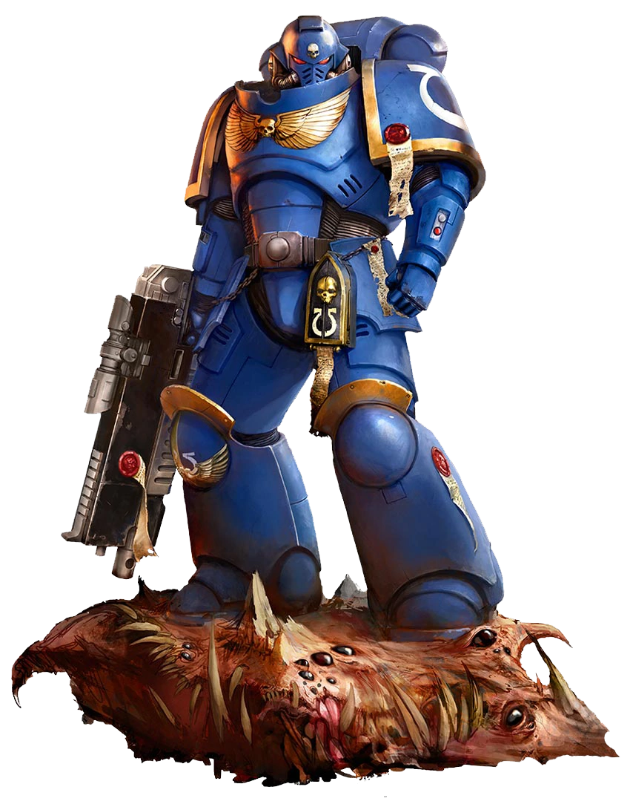

Основные команды git
+ git init - инициализация локального репозитория
+ git status - получить информацию от git о его текущем статусе
+ git add- добавить файл или файлы к следущему коммиту
+ git commit -m "massage" - создание коммита
+ git log - вывод на экран истории всех коммитов с их хеш-кодами
+ git checkout - переход от одного коммита к другому
+ git checkout master - вернуться к актуальному состоянию и продолжить работу
+ git diff - увидеть разницу между текущем файлом и закомминченным файлом

*для того чтобы узнать список комманд используйте git help
https://git-scm.com/book/ru/v2/%D0%9F%D1%80%D0%B8%D0%BB%D0%BE%D0%B6%D0%B5%D0%BD%D0%B8%D0%B5-C%3A-%D0%9A%D0%BE%D0%BC%D0%B0%D0%BD%D0%B4%D1%8B-Git-%D0%9E%D1%81%D0%BD%D0%BE%D0%B2%D0%BD%D1%8B%D0%B5-%D0%BA%D0%BE%D0%BC%D0%B0%D0%BD%D0%B4%D1%8B ,более подробный список комманд и их описание
для того чтобы узнать список комманд используйте git help
https://git-scm.com/book/ru/v2/%D0%9F%D1%80%D0%B8%D0%BB%D0%BE%D0%B6%D0%B5%D0%BD%D0%B8%D0%B5-C%3A-%D0%9A%D0%BE%D0%BC%D0%B0%D0%BD%D0%B4%D1%8B-Git-%D0%9E%D1%81%D0%BD%D0%BE%D0%B2%D0%BD%D1%8B%D0%B5-%D0%BA%D0%BE%D0%BC%D0%B0%D0%BD%D0%B4%D1%8B ,более подробный список комманд и их описание

картинка на ветке 2

